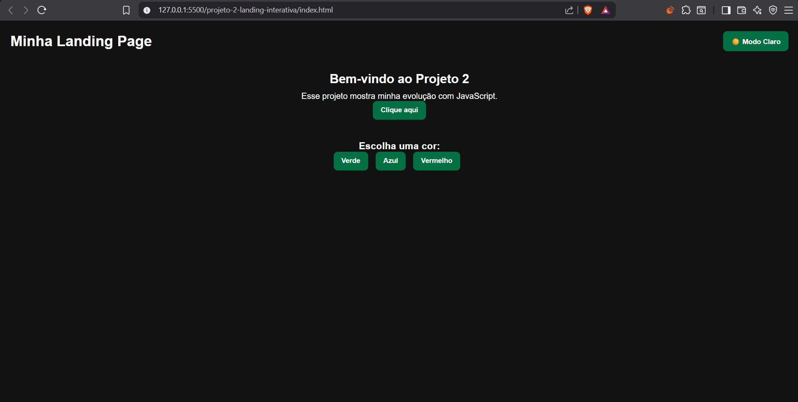

# 💻 Landing Page Interativa

  

## 🌐 Acesse o projeto
https://claudenilsonrichardson.github.io/landing-page-interativa/

## 🚀 Tecnologias
- HTML
- CSS
- JavaScript

## 💡 Funcionalidades
- 🌙 Modo escuro com salvamento
- 🎨 Troca de cores
- 💬 Mensagem dinâmica
- 💾 Uso de localStorage

## 📚 Aprendizados
Este projeto marca minha evolução do HTML/CSS para JavaScript, aplicando interatividade e lógica de programação.
